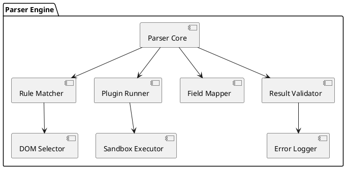
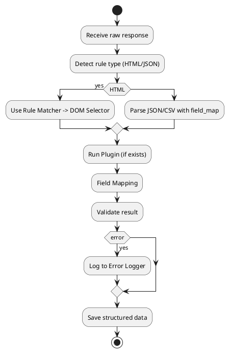
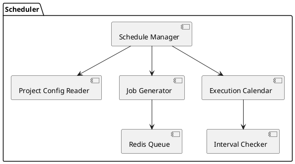
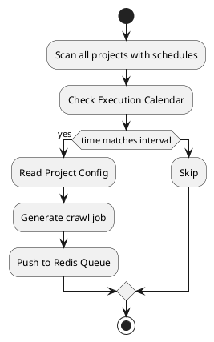
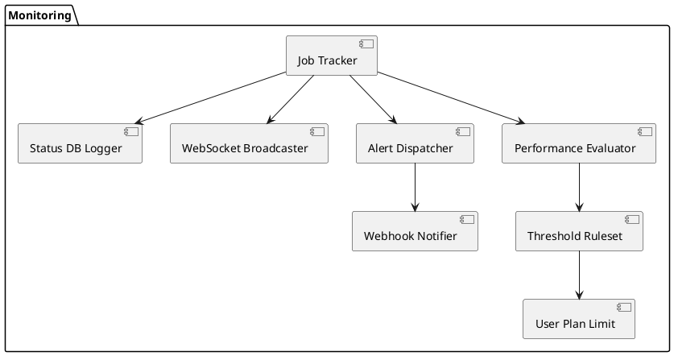
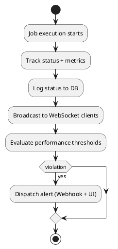
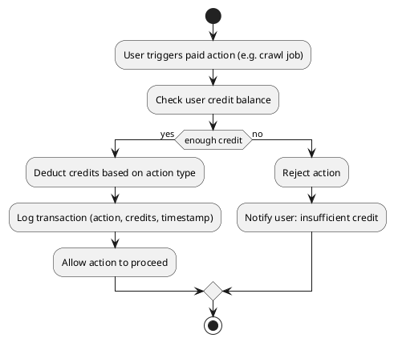
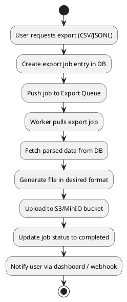
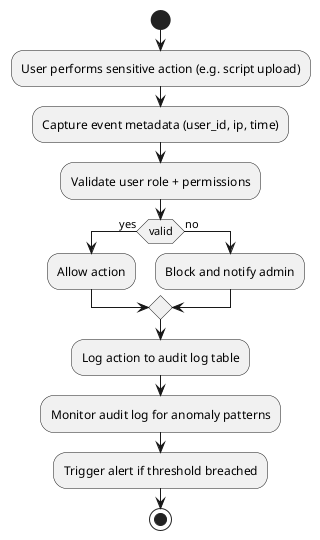
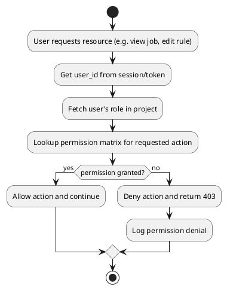

# 🦫 Meerkat Cloud Browser - Tài liệu Kiến trúc Hệ thống

## 📌 Giới thiệu
**Meerkat Cloud Browser** là một hệ thống crawler phiên bản mây chủ, sử dụng Firefox ESR kèm geckordp để thu thập dữ liệu HTTP response theo request từ client (Laravel/WordPress hoặc App bên ngoài). Meerkat cho phép các user tạo project, gán crawler và parser theo rule tự định nghĩa, và nhận kết quả về qua webhook/API.

## 🧩 Kiến trúc tổng thể
```
Client App
  |                
  |--> Meerkat RPC Gateway (Flask)
        |--> Task Queue (RQ/Redis)
        |--> Crawler Node (Firefox + geckordp)
        |--> DOM Parser (BeautifulSoup4 + Rule Engine)
        |--> Result -> PostgreSQL (JSONB)
        |--> Webhook or API callback
        |--> Cold Export: S3/MinIO
        |--> Analytics Push: ClickHouse/BigQuery (optional)
```

## 🔧 Tính năng chính
### 📁 Quản lý Project
- Mỗi user sở hữu nhiều project
- Mỗi project có nhiều data source
- Cấu hình rule parsing, URL, crawl mode, mapping fields

### 🕷️ Crawler Engine
- Firefox ESR + geckordp headless
- Quản lý session/login theo profile user
- Tự scale crawler instance theo project/job
- Cho phép login trước khi crawl (Facebook, Zalo...)

### 🧠 Parser Rule
- Rule dựa trên:
  - HTML (DOM, CSS selector)
  - JSON, CSV
  - URL format, regex
- GUI DOM Picker: tích hợp `@medv/finder` cho selector ngắn
- Tự động sinh rule và preview trực quan

### 🔌 Plugin System (Scripted Parser)
- User nhúng script RestrictedPython theo project
- Sandbox execution, track time + memory + exception
- Warning & chặn plugin vượt ngưỡng (tuỳ theo plan)

### 🧵 Job Engine
- Dựa trên Redis Queue (RQ)
- Multi-thread/task per project
- Retry, backoff, dedup URL, TTL
- Gửi webhook khi hoàn tất hoặc có lỗi

### 🗃️ Lưu trữ dữ liệu
- PostgreSQL với JSONB
- Cold Export: CSV/JSONL → S3/MinIO
- Analytics: ClickHouse / BigQuery

### 📊 Dashboard Admin/User
- Realtime job monitor (WebSocket)
- Job retry / log / preview
- DOM Mapping GUI + plugin editor
- Credit usage & log transaction
- Lịch sử export / webhook event

---

## 🧭 Module Diagram: Parser Engine


### 🔄 Flow Diagram: Parser Engine


---

## 🕒 Module Diagram: Scheduler System


### 🔄 Flow Diagram: Scheduler System


---

## 📡 Module Diagram: Monitor & Metrics


### 🔄 Flow Diagram: Monitor & Metrics


---

## 💳 Flow Diagram: Credit & Billing


## 📤 Flow Diagram: Export Job Pipeline


## 🔐 Flow Diagram: Security Audit Trail


## 🛡️ Flow Diagram: RBAC Access Flow


---

*Đây là tài liệu kỹ thuật hợp nhất, phục vụ export PDF/HTML hoặc chia sẻ nội bộ nhóm dev.*
